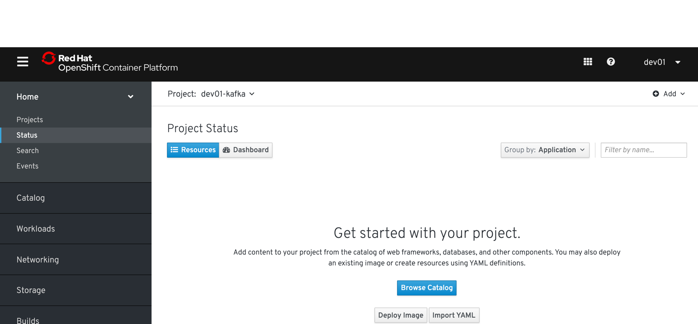
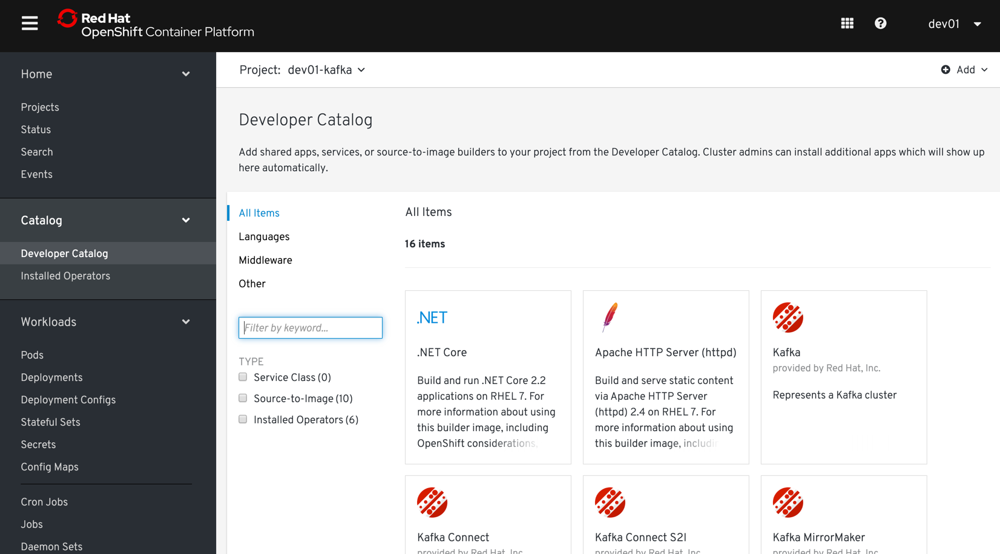
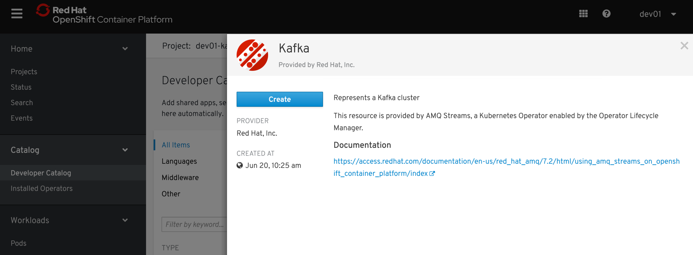
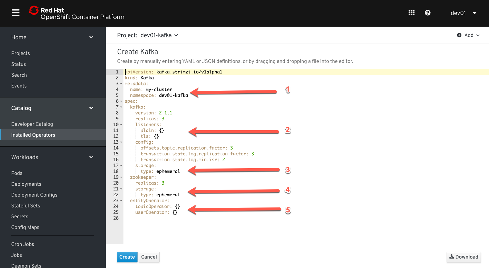
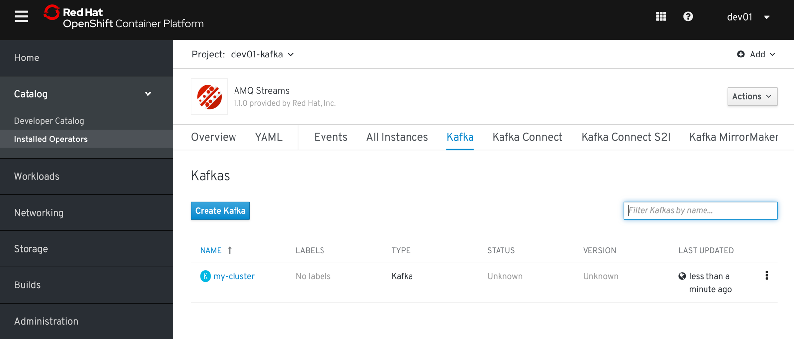
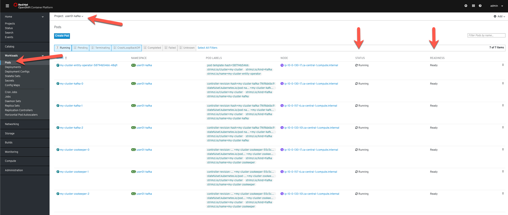

Installation d'un cluster Kafka avec l'opérateur AMQ Streams

##### Étape 1:  Connection au cluster OpenShift

##### Étape 2:  Création d'un cluster Kafka

L'opérateur AMQ Streams a été installé par l'administrateur du cluster et est disponible pour votre projet.

Dans le projet userXX-Kafka, à partir du catalogue, ajouter un cluster Kafka (bouton "Browse Catalog")



Choisir l'option 'Kafka"



Créer un cluster Kafka (bouton "Create")



Examiner le fichier YAML. Ce fichier est utilisé par l'opérateur pour configurer et installer le cluster Kafka.



1)  Nom du cluster et projet dans lequel il sera installé.
2)  Définition des 'listeners' qui seront déployés (Interne au cluster, externe, encryption ou non) et nombre de brokers Kafka
3)  Type de stockage pour Kafka (pour le lab - stockage éphémère dans le conteneur)
4)  Nombre de replicas pour le Zookeeper et type de stockage pour le Zookeeper 
5)  Operators additionnels a déployer

Pour le lab, les paramêtres par défaut seront utilisés

Pour créer le cluster, utiliser le bouton "Create"

L'opéator AMQ Streams démarre le processus de création de votre cluster Kafka:



Attendre que le cluster Kafka démarrre.   



Pour valider l'état du cluster, dans la console OpenShift, selectionner le menu Pod, dans votre projet (userXX-kafka). 
Attendre que les 7 pods du cluster Kafka soient 'Running' et 'Ready'

ou avec l'outil ligne de commande oc:
```
oc get pods -w -n userXX-kafka
```

##### Étape 3:  Validation de l'installation