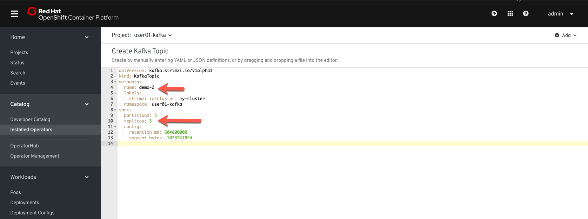
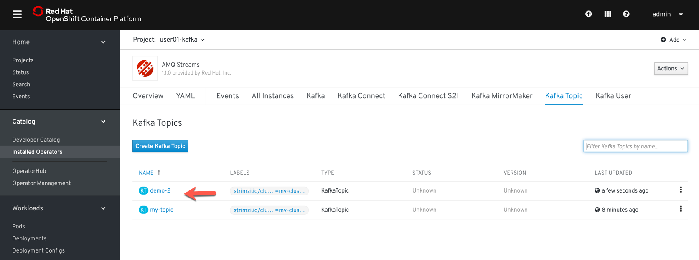
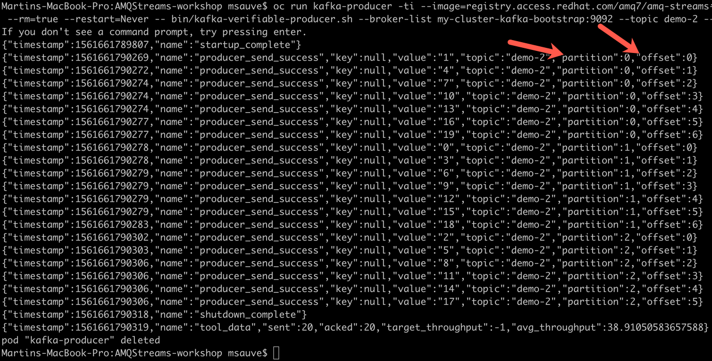

## Partitions Kafka

#### Étape 1:  Création du Topic Kafka

En utilisant l'operator AMQ Streams, créer un topic Kafka nommer "demo-2" avec 3 partitions et 3 replicas:

Dans la console OpenShift

1) Sélectionner le project userXX-kafka
2) Sélectionner "Installed Operators" dans le menu de gauche
3) Créer un nouveau Topic avec le bouton "Create New"


Dans la page de configuration du topic, utiliser les paramêtres suivants:
* name:  demo-2
* partitions: 3
* replicas: 3



Le nouveau Topic demo-2 apparait dans la liste des topics disponible. 
Le topic "my-topic" devrait aussi être présent. Ce topic a été créé automatiquement lors du lab 1.  L'operator a detecté le changement de configuration et à ajouter le topic à la liste des topics disponible. 



Pour valider la configuration du topic dans le zookeeper, utiliser la commande suivante:

```
oc exec my-cluster-zookeeper-0 -it -- bin/kafka-topics.sh --zookeeper localhost:21810  --describe --topic demo-2
```

Cette commande execute l'utilitaire kafka-topics à l'intérieur du conteneur zookeeper

#### Étape 2: Exploration des partitions

Publier 20 messages dans le topic demo-2 avec l'utilisation kafka-verifiable-producer, les messages sont publiés avec un index ordonnancé de 0 à 20 :

```
oc run kafka-producer -ti --image=registry.access.redhat.com/amq7/amq-streams-kafka:1.1.0-kafka-2.1.1 --rm=true --restart=Never -- bin/kafka-verifiable-producer.sh --broker-list my-cluster-kafka-bootstrap:9092 --topic demo-2 --max-messages 20
```



Les messages sont distribués sur le trois partitions et chaque partition démarre à l'offset 0

Lire les messages sur toutes les partitions:


```
 oc run kafka-consumer -ti --image=registry.access.redhat.com/amq7/amq-streams-kafka:1.1.0-kafka-2.1.1 --rm=true --restart=Never -- bin/kafka-console-consumer.sh --bootstrap-server my-cluster-kafka-bootstrap:9092 --topic demo-2 --from-beginning
 ```

L'ordre n'est pas garanti entre les partitions.

Sur une même partition, l'ordre est préservé

```
oc run kafka-consumer -ti --image=registry.access.redhat.com/amq7/amq-streams-kafka:1.1.0-kafka-2.1.1 --rm=true --restart=Never -- bin/kafka-console-consumer.sh --bootstrap-server my-cluster-kafka-bootstrap:9092 --topic demo-2 --from-beginning --partition 0
```