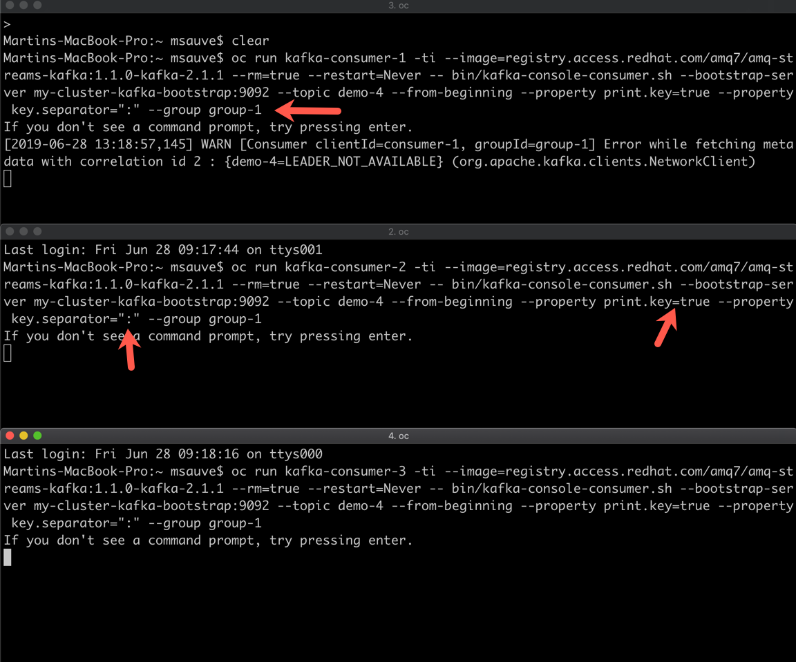

## Partitions, Réplication et "Consumer Groups" Kafka

#### Étape 1:  Création du Topic Kafka

En utilisant l'operator AMQ Streams, créer un topic Kafka nommer "demo-4" avec 3 partitions et 3 replicas:

Dans la console OpenShift

1) Sélectionner le project userXX-kafka
2) Sélectionner "Installed Operators" dans le menu de gauche
3) Créer un nouveau Topic avec le bouton "Create New"


Dans la page de configuration du topic, utiliser les paramêtres suivants:
* name:  demo-4
* partitions: 3
* replicas: 3

Le nouveau Topic demo-4 apparait dans la liste des topics disponible. 


#### Étape 2: Consumers et Consumer Groups 

Ouvrir quatre différentes fenêtres "terminal".

Dans les fenêtres 1 à 3, démarrer 3 Kafka Consumers dans un même Consumer Group:

```
oc run kafka-consumer-1 -ti --image=registry.access.redhat.com/amq7/amq-streams-kafka:1.1.0-kafka-2.1.1 --rm=true --restart=Never -- bin/kafka-console-consumer.sh --bootstrap-server my-cluster-kafka-bootstrap:9092 --topic demo-4 --from-beginning --property print.key=true --property key.separator=":" --group group-1
```

```
oc run kafka-consumer-2 -ti --image=registry.access.redhat.com/amq7/amq-streams-kafka:1.1.0-kafka-2.1.1 --rm=true --restart=Never -- bin/kafka-console-consumer.sh --bootstrap-server my-cluster-kafka-bootstrap:9092 --topic demo-4 --from-beginning --property print.key=true --property key.separator=":" --group group-1
```

```
oc run kafka-consumer-3 -ti --image=registry.access.redhat.com/amq7/amq-streams-kafka:1.1.0-kafka-2.1.1 --rm=true --restart=Never -- bin/kafka-console-consumer.sh --bootstrap-server my-cluster-kafka-bootstrap:9092 --topic demo-4 --from-beginning --property print.key=true --property key.separator=":" --group group-1
```



Dans l'image précédente:

* Group : Identificateur du Consumer Group Kafka pour le client
* key.separator : le client s'attend a recevoir des messages indexés avec ":"  comme séparateur entre l'index et le contenu
* print.key : la clé et le contenu seront affichés.

Ouvrir une quatrième fenêtre "terminal" et démarrer un consumner d'un autre consumer group Kafka:

```
oc run kafka-consumer-g2 -ti --image=registry.access.redhat.com/amq7/amq-streams-kafka:1.1.0-kafka-2.1.1 --rm=true --restart=Never -- bin/kafka-console-consumer.sh --bootstrap-server my-cluster-kafka-bootstrap:9092 --topic demo-4 --from-beginning --property print.key=true --property key.separator=":" --group group-2
```

En résumé:

* Consumer Group "group-1" a trois consumers de déployer
* Consumer Group "group-2" a un consumer de déployer

#### Étape 3: Messages et Index

Démarrer un message producer Kafka capable d'indexer les messages:

```
oc run kafka-producer -ti --image=registry.access.redhat.com/amq7/amq-streams-kafka:1.1.0-kafka-2.1.1 --rm=true --restart=Never -- bin/kafka-console-producer.sh --broker-list my-cluster-kafka-bootstrap:9092 --topic demo-4  --property parse.key=true --property key.separator=":"
```

Envoyer les messages suivants (1 par 1)

* 1:{"Marque":"Honda", "Modeles":["Civic","Accord","Odyssey"]}
* 1:{"Marque":"Volkswagen", "Modeles":["Golf","Tiguan","Jetta"]}
* 2:{"Marque":"Tesla", "Modeles":["S","X","3"]}
* 3:{"Marque":"Toyota", "Modeles":["Camry","Corolla"]}
* Votre création!  - Json avec index et séparateur :

Oberver les résultats, les messages d'un même index devrait se retrouver sur le même client d'un consumer group. 


