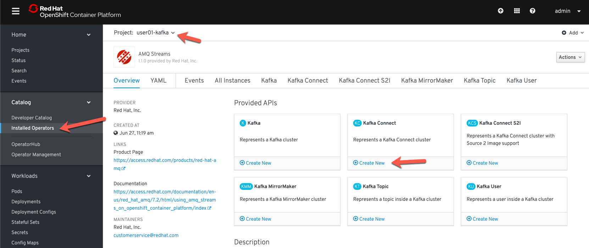
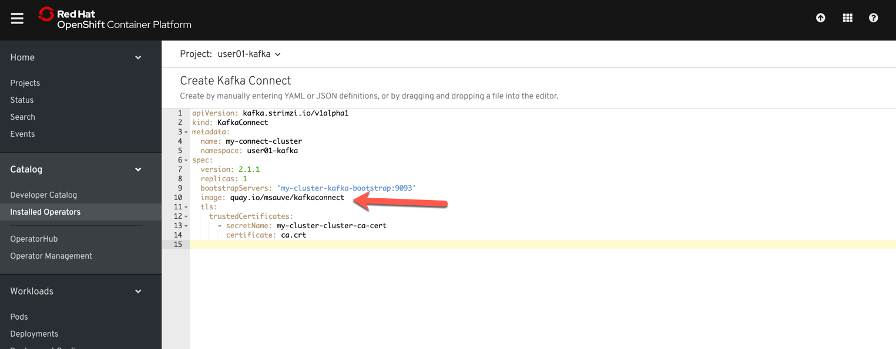

## Kafka Connect

#### Étape 1:  Création du Cluster Kafka Connect

En utilisant l'operator AMQ Streams, créer un cluster Kafka Connect:



Dans la spécification YAML de votre cluster Kafka Connect, ajouter la source de l'image du conteneur.
Des plugins nécessaires à cet exercice ont été ajouté à la configuration de Kafka Connect. Attention au espace, ils sont important

```
  image: quay.io/msauve/kafkaconnect
```



Créer le Cluster Kafka-Connect et attender que le pod soit prêt et déployé.


#### Étape 2: Installation d'une base de données


oc new-app --name=mysql debezium/example-mysql:0.9

oc set env dc/mysql MYSQL_ROOT_PASSWORD=debezium  MYSQL_USER=mysqluser MYSQL_PASSWORD=mysqlpw


#### Étape 3 : Création d'un connecteur avec l'API Kafka Connect

Exécuter le script suivant dans une fenêtre "Terminal" pour créer une source d'événements Kafka-Connect.

```
oc exec -i -c kafka my-cluster-kafka-0 -- curl -X POST \
    -H "Accept:application/json" \
    -H "Content-Type:application/json" \
    http://my-connect-cluster-connect-api:8083/connectors -d @- <<'EOF'

{
    "name": "inventory-connector",
    "config": {
        "connector.class": "io.debezium.connector.mysql.MySqlConnector",
        "tasks.max": "1",
        "database.hostname": "mysql",
        "database.port": "3306",
        "database.user": "debezium",
        "database.password": "dbz",
        "database.server.id": "184054",
        "database.server.name": "dbserver1",
        "database.whitelist": "inventory",
        "database.history.kafka.bootstrap.servers": "my-cluster-kafka-bootstrap:9092",
        "database.history.kafka.topic": "schema-changes.inventory"
    }
}
EOF
```

#### Étape 4 : Exécution de Kafka-Connect


oc run kafka-consumer -ti --image=registry.access.redhat.com/amq7/amq-streams-kafka:1.1.0-kafka-2.1.1 --rm=true --restart=Never -- bin/kafka-console-consumer.sh --bootstrap-server my-cluster-kafka-bootstrap:9092     --property print.key=true --topic dbserver1.inventory.customers --from-beginning


mysql -u mysqluser -p 
mysqlpw

use inventory;

insert into customers values (null,'Martin', 'Sauve', 'me@me.com');
