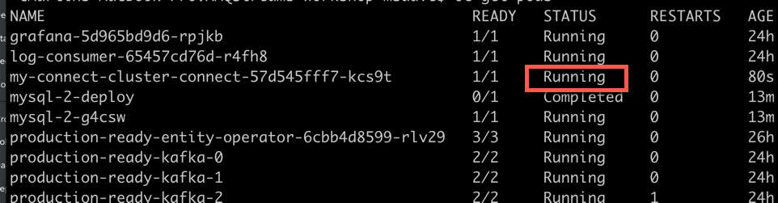
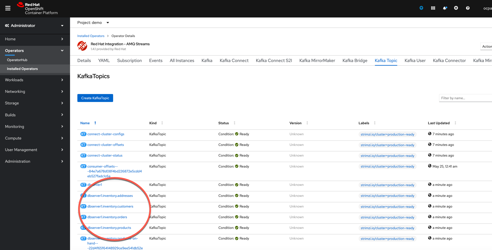
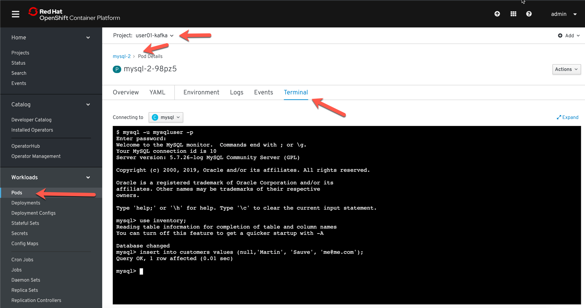

## Kafka Connect


#### Étape 1: Installation d'une base de données

dans votre project OpenShift déployer une base de données MySql

```
oc new-app --name=mysql debezium/example-mysql:0.9

oc set env dc/mysql MYSQL_ROOT_PASSWORD=debezium  MYSQL_USER=mysqluser MYSQL_PASSWORD=mysqlpw
```


#### Étape 2:  Création du Cluster Kafka Connect

Créer un secret Kubernetes avec les informations de connectivité pour la base de données MySqL:
```
apiVersion: v1
data:
  debezium-mysql-credentials.properties: bXlzcWxfdXNlcm5hbWU6IGRlYmV6aXVtCm15c3FsX3Bhc3N3b3JkOiBkYnoK
kind: Secret
metadata:
  name: my-sql-credentials
type: Opaque
```

```
oc apply -f https://raw.githubusercontent.com/masauve/AMQStreams-workshop/master/manifests/my-sql-credentials.yaml
```


En utilisant l'operator AMQ Streams, créer un cluster Kafka Connect.

```
apiVersion: kafka.strimzi.io/v1beta1
kind: KafkaConnect
metadata:
  name: my-connect-cluster
  annotations:
  # use-connector-resources configures this KafkaConnect
  # to use KafkaConnector resources to avoid
  # needing to call the Connect REST API directly
    strimzi.io/use-connector-resources: "true"
spec:
  image: quay.io/msauve/kafkaconnect
  replicas: 1
  bootstrapServers: production-ready-kafka-bootstrap:9093
  tls:
    trustedCertificates:
      - secretName: production-ready-cluster-ca-cert
        certificate: ca.crt
  config:
    config.storage.replication.factor: 1
    offset.storage.replication.factor: 1
    status.storage.replication.factor: 1
    config.providers: file
    config.providers.file.class: org.apache.kafka.common.config.provider.FileConfigProvider
  externalConfiguration:
    volumes:
      - name: connector-config
        secret:
          secretName: my-sql-credentials
```
```
oc apply -f https://raw.githubusercontent.com/masauve/AMQStreams-workshop/master/manifests/kafka-connect.yaml
```
Attendez que le pods Kafka Connect soit démarrer:

```
oc get pods 
```



#### Étape 3 : Création d'un connecteur Kafka Connect avec l'Operator AMQStreams

Exécuter le script suivant (MacOS, Bash ou Linux) dans une fenêtre "Terminal" pour créer une source d'événements Kafka-Connect.

```
apiVersion: "kafka.strimzi.io/v1alpha1"
kind: "KafkaConnector"
metadata:
  name: "inventory-connector"
  labels:
    strimzi.io/cluster: my-connect-cluster
spec:
  class: io.debezium.connector.mysql.MySqlConnector
  tasksMax: 1
  config:
    database.hostname: mysql
    database.port: "3306"
    database.user: "${file:/opt/kafka/external-configuration/connector-config/debezium-mysql-credentials.properties:mysql_username}"
    database.password: "${file:/opt/kafka/external-configuration/connector-config/debezium-mysql-credentials.properties:mysql_password}"
    database.server.id: "184054"
    database.server.name: "dbserver1"
    database.whitelist: "inventory"
    database.history.kafka.bootstrap.servers: "production-ready-kafka-bootstrap:9092"
    database.history.kafka.topic: "schema-changes.inventory"
    include.schema.changes: "true" 
```

```
oc apply -f https://raw.githubusercontent.com/masauve/AMQStreams-workshop/master/manifests/kafka-connector.yaml
```

#### Étape 3 : Tester l'installation du connecteur

Le connecteur devrait avoir créer plusieurs Topics sur votre cluster Kafka. Ces topics représentent la structure de votre base de données:




Ouvrir un client Kafka sur le topic inventory.customers:

```
oc run kafka-consumer -ti --image=registry.access.redhat.com/amq7/amq-streams-kafka:1.1.0-kafka-2.1.1 --rm=true --restart=Never -- bin/kafka-console-consumer.sh --bootstrap-server production-ready-kafka-bootstrap:9092     --property print.key=true --topic dbserver1.inventory.customers --from-beginning
```

Dans la console Openshift, ouvrir un terminal à l'intérieur du Pod MySql:



* Project: votre projet
* Workloads: Pods
* MySQL pod
* Terminal Tab

Dans le terminal, effectuer la connection à MySQl avec le client mysql installé dans le conteneur:

```
mysql -u mysqluser -p 
```

* password: mysqlpw

Sélectionner la base de données "Inventory":

```
use inventory;
```

Insérer des données (par example):

```
insert into customers values (null,'Martin', 'Sauve', 'me@me.com');
```


Le contenu de la BD devrait être automatiquement envoyé par Kafka-Connect sur le topic Kafka (dbserver1.inventory.customers)


